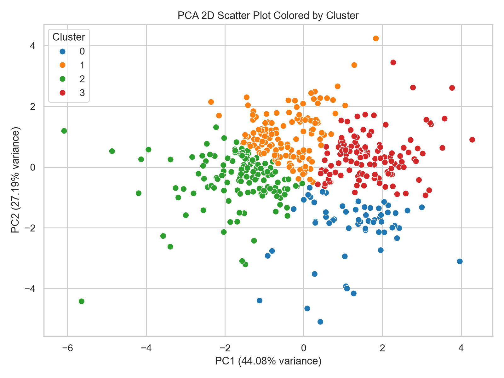
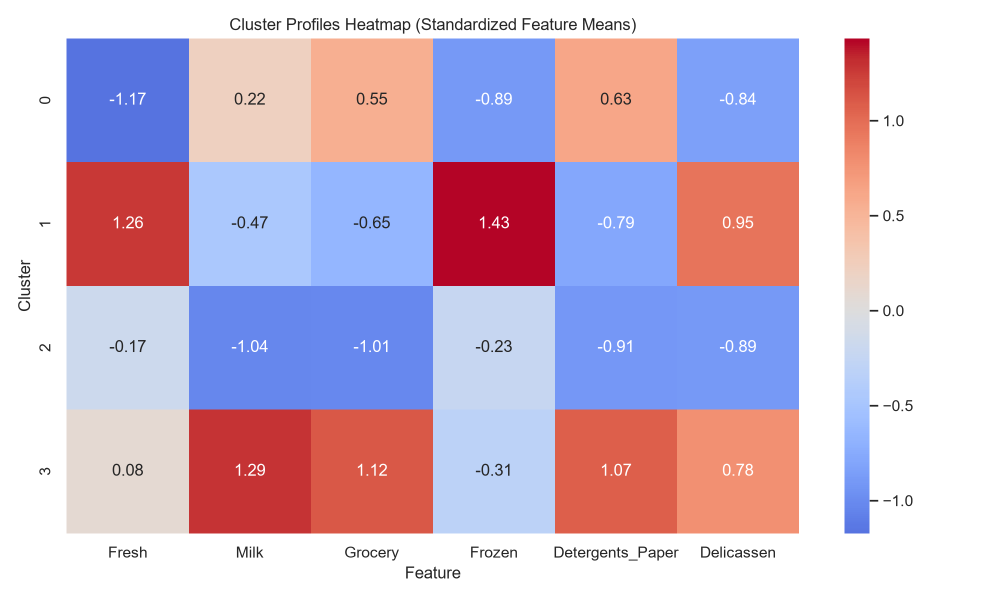
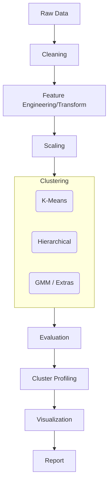
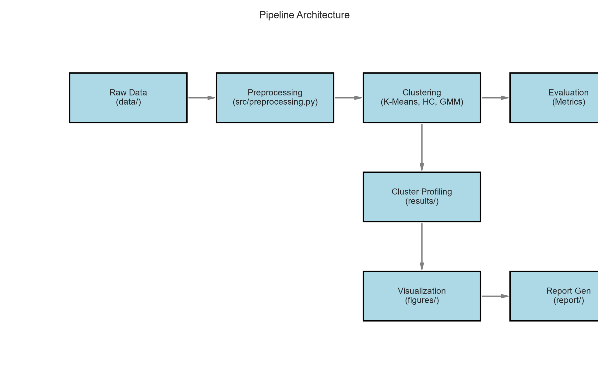

# Unsupervised Learning and Clustering Analysis: Wholesale Customers

This project applies unsupervised machine learning to group wholesale customers. I clustered the customers based on how much they spend each year on different product categories. I used K-Means and Hierarchical Clustering algorithms to find these groups without using predefined labels. Grouping similar clients helps the business understand purchasing patterns so they can improve marketing and inventory planning.

## Problem Statement and Goals

Wholesale distributors serve different types of clients. A small cafe buys different products than a large grocery store. My goal was to discover natural groups in historical spending data. Finding these groups helps the business understand its customers and make better decisions.

## Dataset

- **Name:** UCI Wholesale Customers Dataset
- **Source:** [UCI Machine Learning Repository](https://archive.ics.uci.edu/ml/datasets/Wholesale+customers)
- **Size:** 440 rows, 8 columns

| Feature | Description |
|---|---|
| `Fresh` | Annual spending on fresh products (Continuous) |
| `Milk` | Annual spending on milk products (Continuous) |
| `Grocery` | Annual spending on grocery products (Continuous) |
| `Frozen` | Annual spending on frozen products (Continuous) |
| `Detergents_Paper` | Annual spending on detergents and paper products (Continuous) |
| `Delicassen` | Annual spending on delicatessen products (Continuous) |
| `Channel` | Customer Channel (Horeca/Retail) - *Ignored for clustering* |
| `Region` | Customer Region - *Ignored for clustering* |

## Key Results

I selected **K-Means with k=4** as the final model. It achieved a Silhouette Score of ~0.24, Calinski-Harabasz score of ~123, and Davies-Bouldin score of ~1.46 (metrics evaluated on the preprocessed, log-scaled data).

**Cluster Summaries:**
- **Cluster 0:** Average spenders across most categories. They form the baseline customer segment.
- **Cluster 1 (Fresh Food Specialists):** High spending on Fresh products, but low spending on Detergents/Paper. This likely corresponds to restaurants or fresh food markets.
- **Cluster 2 (Retail/Grocery Heavy):** High spenders in Grocery, Milk, and Detergents_Paper. This group matches the profile of retail grocery stores.
- **Cluster 3 (Low Spenders):** Low overall spenders across all categories. This represents smaller clients or specialized small shops.

### Selected Visualizations


*Figure: 2D PCA scatter plot showing distinct clusters based on purchasing behavior.*


*Figure: Standardized feature means across clusters. It highlights the differences between each group.*

## Architecture

### Pipeline Diagram (Mermaid)



### Generated Architecture Diagram


*Figure: Programmatically generated architecture diagram matching the pipeline above.*

### Module Explanations
- `src/data_loader.py`: Downloads the dataset from the repository and loads it into memory.
- `src/preprocessing.py`: Drops the categorical labels (Channel/Region). It applies a `log1p` transformation to fix right-skewed data and standardizes the features using `StandardScaler`.
- `src/clustering.py`: Contains functions to run K-Means, Agglomerative Hierarchical clustering, Gaussian Mixture Models, and Principal Component Analysis (PCA).
- `src/evaluation.py`: Calculates Silhouette, Calinski-Harabasz, and Davies-Bouldin scores for different cluster counts.
- `src/visualization.py`: Creates plots (elbow curves, scatter plots, heatmaps, dendrograms) and saves them to the `/figures` directory.
- `src/generate_report.py`: Builds a Word `.docx` report programmatically. It inserts the text, metrics, and saved figures.
- `src/run_pipeline.py`: The main script that runs all steps in order. It takes data from `/data`, processes it, and outputs to `/results`, `/figures`, and `/report`.

## Project Structure

```text
├── data/
│   ├── processed/
│   └── wholesale_customers.csv
├── docs/
│   └── architecture.png
├── figures/
│   ├── elbow_metrics.png
│   ├── cluster_profiles_heatmap.png
│   └── ...
├── notebooks/
│   └── clustering_analysis.ipynb
├── report/
│   └── Clustering_Report.docx
├── results/
│   ├── model_metrics.csv
│   └── cluster_assignments.csv
│   └── cluster_profiles.csv
├── src/
│   ├── data_loader.py
│   ├── preprocessing.py
│   ├── clustering.py
│   ├── evaluation.py
│   ├── visualization.py
│   ├── generate_report.py
│   ├── generate_notebook.py
│   └── run_pipeline.py
├── README.md
└── requirements.txt
```

## Installation

This project requires **Python 3.9+**.

```bash
python -m venv venv
# On Windows:
.\venv\Scripts\Activate.ps1
# On macOS/Linux:
source venv/bin/activate

pip install -r requirements.txt
```

## How to Run

1. **Run the entire pipeline automatically:**
   ```bash
   python src/run_pipeline.py
   ```
   *This command runs preprocessing, clustering, and evaluation. It creates all figures and generates the final Word report.*

2. **Open the interactive Jupyter Notebook:**
   First, run the notebook generator script if the notebook doesn't exist yet:
   ```bash
   python src/generate_notebook.py
   ```
   Then start Jupyter:
   ```bash
   jupyter notebook notebooks/clustering_analysis.ipynb
   ```

## Methodology Summary

1. **Preprocessing:** I noticed the spending features were heavily right-skewed. I applied a `log1p` transformation to make the distributions more normal. Then, I scaled the data using `StandardScaler`. This step is necessary because distance-based algorithms like K-Means are sensitive to feature scales. I dropped categorical labels like Channel and Region so the clustering only uses behavioral spending data.
2. **Algorithms:** I used K-Means as the baseline algorithm. I ran Hierarchical Clustering with Ward linkage as a second method, and I drew a dendrogram to check the structure. I also added Gaussian Mixture Models (GMM) because it handles different cluster shapes better. I used Principal Component Analysis (PCA) to reduce the data to two and three dimensions for plotting.
3. **Choosing k:** I tested `k` from 2 to 10 for the K-Means algorithm. The Elbow method and Silhouette scores showed that `k=2` was a strong mathematical choice. I chose `k=4` instead because it still had good metrics and provided more useful business groups than simply splitting clients into high and low spenders.
4. **Metrics:** I computed the Silhouette Score, Calinski-Harabasz Index, and Davies-Bouldin Index to measure how well the clusters were separated.

## Limitations and Future Work

- **Distance Metrics Assumption:** K-Means assumes clusters are spherical. GMM handles different shapes, but K-Means was the main focus. This means complex patterns might be missed.
- **Outliers:** The log transformation helped reduce the impact of extreme outliers. However, a few clients who spend massive amounts could still distort the cluster centers. In the future, I could try removing outliers with an Isolation Forest before clustering.
- **Future Actions:** I plan to check how well my new clusters map to the original `Channel` and `Region` variables. For example, I want to see if the "Fresh Food Specialists" group mostly belongs to the "Horeca" channel.

## Credits and License

- **Dataset Credit:** UCI Machine Learning Repository (Margarida G. M. S. Cardoso).
- **License:** MIT License
